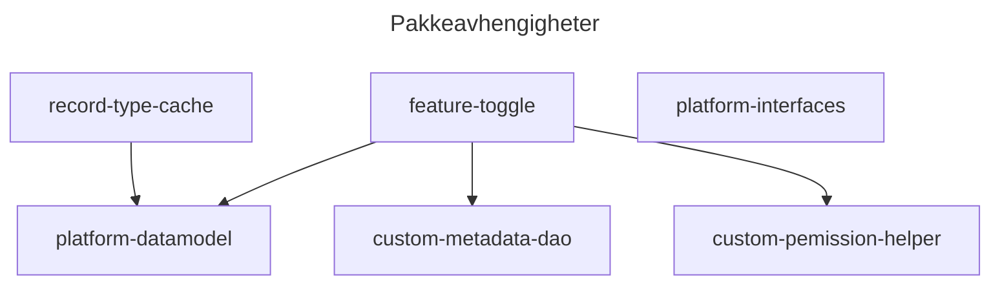

# sf-platform

Monorepo for NAVs Salesforce Platform core. Vedlikeholdt av Team Platforce.

[Platforce Documentation](https://navikt.github.io/platforce-doc/)

## Pakker

For å se avhengigheter mellom pakkene se [sfdx-project.json](sfdx-project.json)

- [platform-datamodel](src/platform-data-model/feature-flag-custom-metadata) - datamodell

### [Frameworks](src/frameworks)

- [feature-toggle](src/frameworks/feature-toggle/README.md) rammeverk for feaure toggling i salesforce

### [Platform Utility](src/platform-utility)

- [custom-metadata-dao](src/platform-utility/custom-metadata-dao) - Abstraksjon av custom metadata
- [custom-pemission-helper](src/platform-utility/custom-permission-helper) - Hjelpe funksjoner for custom settings
- [platform-interfaces](src/platform-utility/platform-interfaces) - Interfaces og Binding Custom Metadata for bruk av [force-di](https://github.com/navikt/sf-external-force-di)
- [record-type-cache](src/platform-utility/record-type-cache) - Cacher alle record types i org cachen sånn at man slipper å spørre på dem.

## Komme i gang

For å sette opp utviklingsmiljøet se [Platforce Docs - Developer environment](https://navikt.github.io/platforce-doc/how-to-guides/dev-environment/)

For detaljer rundt utvikling eller bruk av en spesifikk pakke, se pakke beskrivelsen for nærmere beskrivelser.

For å spinne opp en scratch org så kan man ta utgangspunkt i scratch org definition filen som ligger her: `config/project-scratch-def.json`

---

### Henvendelser

Spørsmål knyttet til koden eller prosjektet kan stilles som issues her på GitHub.

### For NAV-ansatte

Interne henvendelser kan sendes via Slack i kanalen #platforce.
