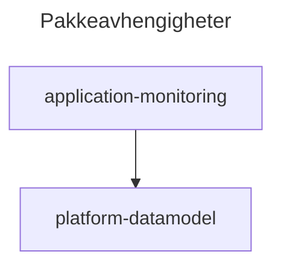

# application-monitoring

## Application Log

Logger rammeverk som publiserer logger til Application_Log\_\_c

Datamodellen ligger i pakken [platform-data-model](src/platform-data-model/README.md)

|         |     |
| ------- | --- |
| Apex    | ✅  |
| LWC     | ✅  |
| Flow    | ✅  |
| Trigger | ✅  |

## Hvordan ta i bruk

Husk å angi teamet som er ansvarlig for funksjonaliteten som logges i LoggerUtility.

```java
  private LoggerUtility logger = new LoggerUtility(
        CRM_ApplicationDomain.Domain.PLATFORCE,
        'LoginFlow'
    );

    logger.errorAndPublish('Error message');
    logger.warningAndPublish('Warning message');
    logger.infoAndPublish('Info message');
```

## Avhengigheter

- [platform-datamodel](src/platform-data-model/feature-flag-custom-metadata) - datamodell


