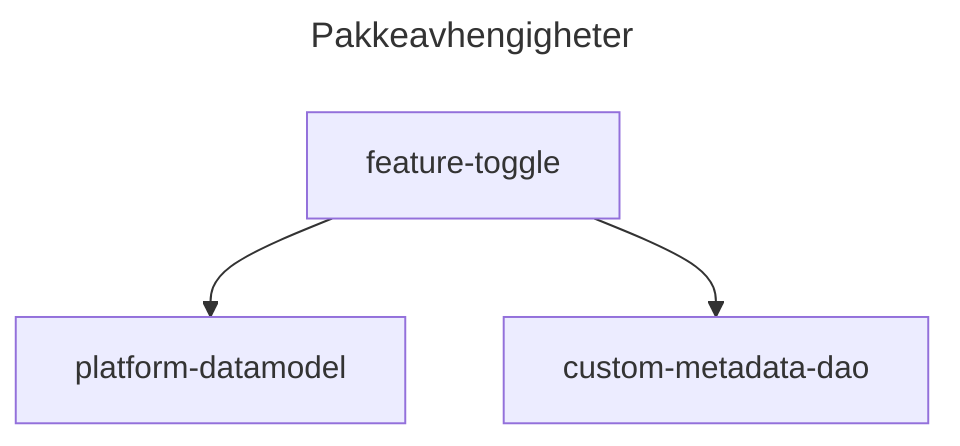

# feature-toggle

Denne pakken inneholder et rammeverk for feature toggling som kan brukes som det er eller extendes.

Datamodellen ligger i pakken [platform-data-model](src/platform-data-model/README.md)

|      |     |
| ---- | --- |
| Apex | ✅  |
| LWC  | ❌  |
| Flow | ✅  |

## Hvordan ta i bruk

Avhengig av behov så kan man enten bruke `FeatureToggleBase` direkte eller extende den for å se om en feature er aktiv eller ikke.
Denne kan brukes på to nivåer, individuell eller generell.

Feature toggle customMetadata innslag og customPermissions legges i de pakkene hvor de brukes.

**Generell:**
Det man ønsker å enkelt kunne skru en feature på eller av. Opprett en custom metadata feature toggle og aktiver/deaktiver den ved å benytte `Is_Enabled__c` flagget.
I koden sjekker man på `isFeatureEnabled(<developername til gitt feature>)`. Dette vil da gjelde for all logikk som kjører koden.

**Individuell:**
Her kan man velge å bruke enten `customPermission` eller en kombinasjon av `Feature_Flag__mdt` og `customPermission`.

Ved bruk av bare `customPermission` oppretter man en custom permission og legger den til et Permission Set som tildeles den eller de som trenger tilgangen.

Ved bruk av en kombinasjon så opprettes det et custom permission som tildeles via Permission Set slik som over. I tillegg opprettes det et `Feature_Flag__mdt` record hvor customPermission api navnet legges til i `Required_Custom_Permission__c`. `Is_Enabled__c` flagget benyttes som vanlig til å toggle featuren av og på.

**Eksempel på direkte bruk:**

```java
public with sharing MyClass {
    public MyClass() {
        ...
    }

    public Decimal getDiscount() {
        if(new FeatureToggleBase().isFeatureEnabled('improved-discount-calculation')) {
            return getDiscountBeta();
        }
        ...
        return discount
    }

    private Decimal getDiscountBeta() {
        ...
        return discount;
    }

    ...
}
```

**Eksempel hvor man extender FeatureToggleBase:**

```java
public with sharing MyClass extends FeatureToggleBase {
    public MyClass() {
        ...
    }

    public Decimal getDiscount() {
        if(isFeatureEnabled('improved-discount-calculation')) {
            return getDiscountBeta();
        }
        ...
        return discount
    }

    private Decimal getDiscountBeta() {
        ...
        return discount;
    }

    ...
}
```

## Avhengigheter

- [platform-datamodel](src/platform-data-model/feature-flag-custom-metadata) - datamodell
- [custom-metadata-dao](src/platform-utility/custom-metadata-dao) - Abstraksjon av custom metadata


