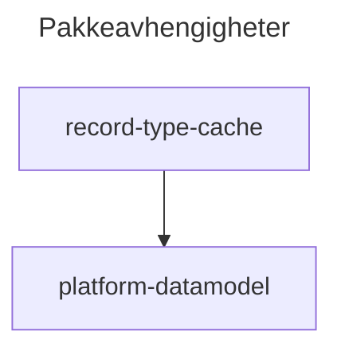

# record-type-cache

Pakke for å cache record types. For å begrense database oppslag mot Record Type tabellen så brukes det en org cache.  
Vi kan hente ut Record Type basert på Salesforce Id og DeveloperName. Når vi henter ut basert på developer name så må vi sende med sObjectName da to objekt kan ha samme developer name på hvert sitt Record Type.
Det er også mulig å hente ut et map med Record Types basert på sObjectName.

## Hvordan ta i bruk

**Eksempel på bruk:**

```java
// Example usage of the RecordTypeCache class
RecordType recordTypeById = RecordTypeCache.getRecordTypeById('012000000000001AAA');
RecordType recordTypeByDeveloperName = RecordTypeCache.getRecordTypeByDeveloperName('Account', 'Business_Account');
Map<String, RecordType> accountRecordTypes = RecordTypeCache.getRecordTypesBySObjectType('Account');

//Example of clearing the cache (when a record type is created, updated, or deleted, you may want to clear the cache to ensure that the cache is refreshed with the latest record type information)
RecordTypeCache.clearCache();
```

**Test eksempel:**

```java
//Set the cache in RecordTypeCache without involving the cache with a predefined mock.
RecordTypeCacheTestUtility.initCacheWithMocks();

//Set the cache in RecordTypeCache without involving the cache.
RecordTypeCacheTestUtility.initCacheWithMocks(List<RecordType>);

//Get RecordTypeHolder with a predefined mock.
RecordTypeCacheTestUtility.getCacheHolderWithMocks();

//Get RecordTypeHolder with the supplied mock.
RecordTypeCacheTestUtility.getCacheHolderWithMocks(List<RecordType>);

// Test example using a mock RecordTypeSelector to inject test data into the cache
private class RecordTypeSelectorStub implements RecordTypeSelector {
  private List<RecordType> records;
  public RecordTypeSelectorStub(List<RecordType> records) {
      this.records = records;
  }
  public List<RecordType> getRecordTypes() {
    return records;
  }
}

@IsTest
private class MyTestClass {
  List<RecordType> mockRecordTypes = new List<RecordType>{
    new RecordType(Id = '012000000000001AAA', DeveloperName = 'Test_Record_Type_1', Name = 'Test Record Type 1', SobjectType = 'Account', IsActive = true),  //NOPMD - This is a mock id
    new RecordType(Id = '012000000000002AAA', DeveloperName = 'Test_Record_Type_2', Name = 'Test Record Type 2', SobjectType = 'Contact', IsActive = true)  //NOPMD - This is a mock id
  };

  @IsTest
    private static void testRecordTypeCacheWithMockSelector() {
    RecordTypeCache.selector = new RecordTypeSelectorStub(mockRecordTypes);
    Test.startTest();
    RecordType result = RecordTypeCache.getRecordTypeById('012000000000001AAA'); //NOPMD - This is a mock id
    Test.stopTest();
    System.Assert.isNotNull(result, 'Expected to have a mock recordtype returned');
    System.Assert.areEqual('012000000000001AAA', result.Id, 'Expected the id of the result to be the same as the mock'); //NOPMD - This is a mock id
  }
}
```

## Avhengigheter

- [platform-datamodel](src/platform-data-model/feature-flag-custom-metadata) - datamodell


